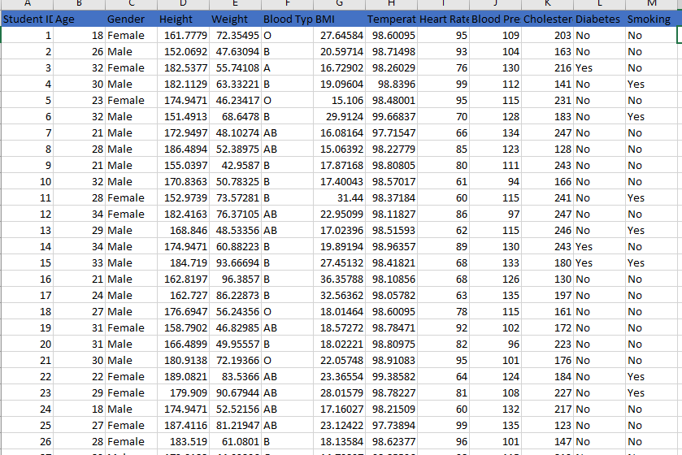
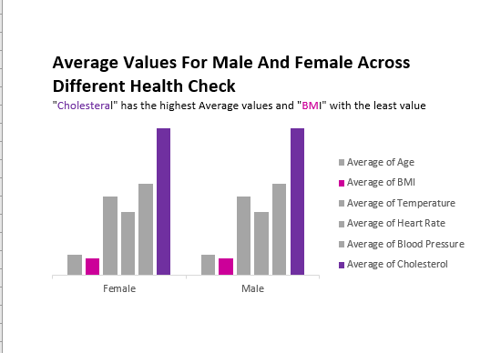
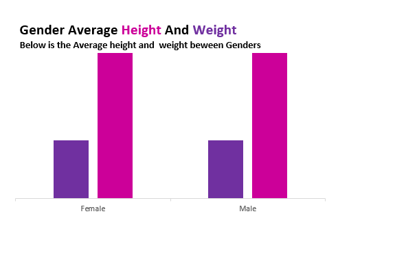
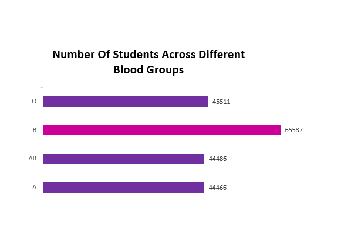
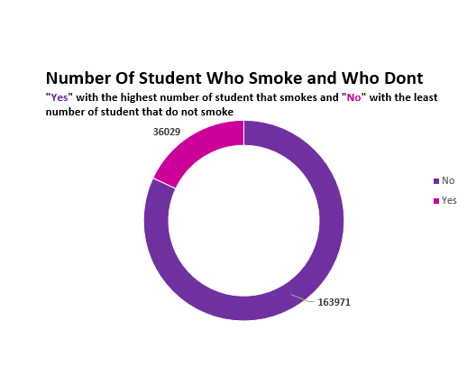
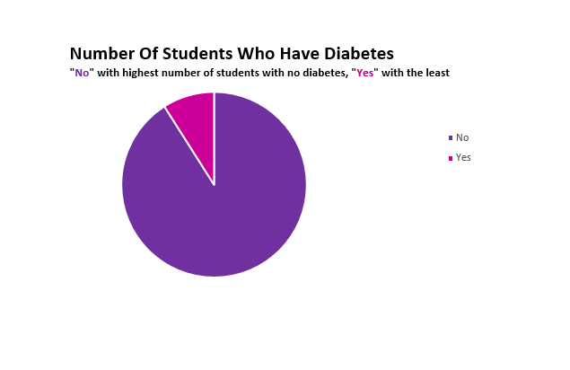
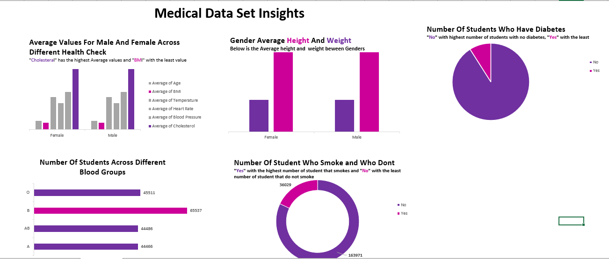

# Medical-student-dataset

##The data was set comprises of 13 columns and 180,001 rows.
Each columns has 20,000 blank spaces.

Task

Using the Medical Students Data, create Pivot Tables displaying the following:
Average values for the following for Male and Females (Age, BMI, Temperature, Heart Rate, Blood Pressure, and Cholesterol)
Average Height and Weight for both Genders (in 2 decimal places)
Number of students across the different Blood Groups
Number of Students who smoke and those who don’t
Number of Students who have diabetes and those who don’t

##Solution 
I used the Fill series to fill the Student ID columns, all numerical column was replace with average of each column, 
text column was replaced the mode of each column and BMI column was calculated with ([Weight]/([Height]*[Height]))*10000

##PIVOT ANALYSIS

##DATA VISUALISATION

Shows the Average Values for Male and Female across Different Health Check. the graph shows cholesterol has the highest
average values in both male and female, while BMI shows the least average values in both male and female.

The graph shows the average height and weight in both genders(male,
female).. both male and female has the same average value in Height
"174.93" and the same average value in weight"69.97"

Graphical representation of student across different Blood groups.

Doughnut graph represents number of students who smoke and who dont

The pie chart shows the number of students who have diabetes and
who dont. we can see that students with no diabetes are more than
students with diabetes.

##Full Dashboard

